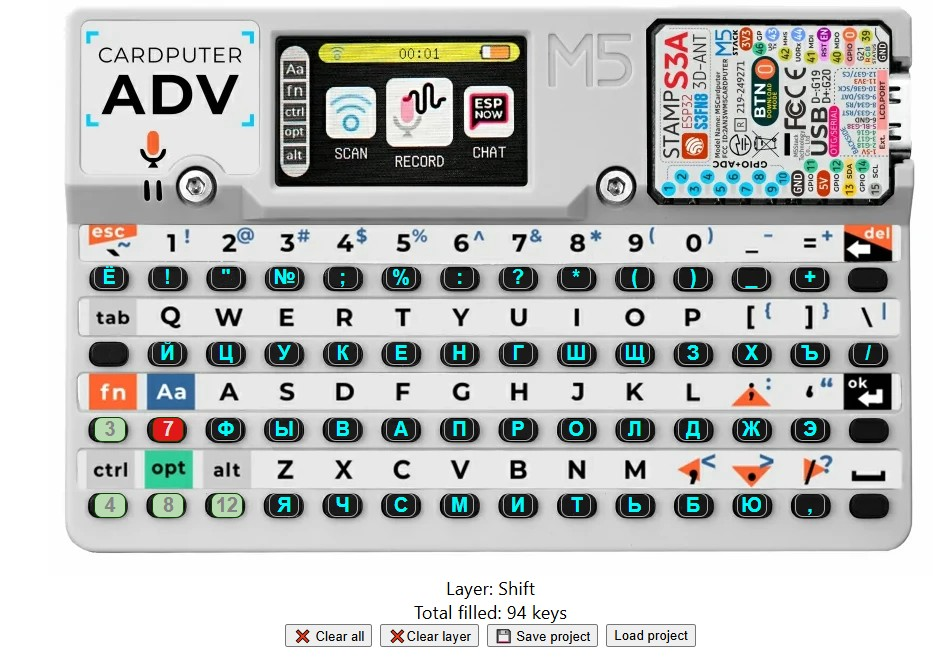

# Cardputer-Adv Layout Editor

A utility to make it easier to create your own layouts. You need to convert the JSON into the format you need.




Key codes:

```cpp
// Non normalized (raw TCA8418 events)
// 1  5  11  15  21  25  31  35  41  45  51  55  61  65
// 2  6  12  16  22  26  32  36  42  46  52  56  62  66
// 3  7  13  17  23  27  33  37  43  47  53  57  63  67
// 4  8  14  18  24  28  34  38  44  48  54  58  64  68

// Normalized ((evt - 1) / 10) * 8 + ((evt - 1) % 10) + 1
//  1   5   9  13  17  21  25  29  33  37  41  45  49  53
//  2   6  10  14  18  22  26  30  34  38  42  46  50  54
//  3   7  11  15  19  23  27  31  35  39  43  47  51  55
//  4   8  12  16  20  24  28  32  36  40  44  48  52  56

enum Key : uint8_t {
  KEY_NONE = 0,

  // Column 1
  KEY_ESC = 1,
  KEY_TAB = 2,
  KEY_FN = 3,
  KEY_CTRL = 4,

  // Column 2
  KEY_1 = 5,
  KEY_Q = 6,
  KEY_SHIFT = 7,
  KEY_OPT = 8,

  // Column 3
  KEY_2 = 9,
  KEY_W = 10,
  KEY_A = 11,
  KEY_ALT = 12,

  // Column 4
  KEY_3 = 13,
  KEY_E = 14,
  KEY_S = 15,
  KEY_Z = 16,

  // Column 5
  KEY_4 = 17,
  KEY_R = 18,
  KEY_D = 19,
  KEY_X = 20,

  // Column 6
  KEY_5 = 21,
  KEY_T = 22,
  KEY_F = 23,
  KEY_C = 24,

  // Column 7
  KEY_6 = 25,
  KEY_Y = 26,
  KEY_G = 27,
  KEY_V = 28,

  // Column 8
  KEY_7 = 29,
  KEY_U = 30,
  KEY_H = 31,
  KEY_B = 32,

  // Column 9
  KEY_8 = 33,
  KEY_I = 34,
  KEY_J = 35,
  KEY_N = 36,

  // Column 10
  KEY_9 = 37,
  KEY_O = 38,
  KEY_K = 39,
  KEY_M = 40,

  // Column 11
  KEY_0 = 41,
  KEY_P = 42,
  KEY_L = 43,
  KEY_COMMA = 44,

  // Column 12
  KEY_MINUS = 45,
  KEY_LBRACKET = 46,
  KEY_SEMICOLON = 47,
  KEY_PERIOD = 48,

  // Column 13
  KEY_PLUS = 49,
  KEY_RBRACKET = 50,
  KEY_APOSTROPHE = 51,
  KEY_SLASH = 52,

  // Column 14
  KEY_BACK = 53,
  KEY_BACKSLASH = 54,
  KEY_RETURN = 55,
  KEY_SPACE = 56
};
```
